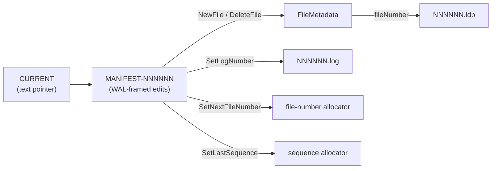

# 02. On-disk format

This is the byte-exact specification of every file leveldb-java writes. If you change anything in this document, you are changing a wire format — bump the SSTable version, add an ADR, and add a round-trip test.

**Universal rules** (no exceptions in any format below):

- All multi-byte integers are **little-endian**.
- CRC32 is `java.util.zip.CRC32` (polynomial `0xEDB88320`), default initial state, **no LevelDB-style "mask"** applied. This is a deliberate deviation from the LevelDB C++ format.
- Compression: only `none` (`0x00`) and `deflate` (`0x01`). Deflate output is a standard zlib stream (`Deflater` with `nowrap=false`). No native Snappy support — see ADR-0008.

## File inventory under `dbDir/`

| Pattern | Producer | Purpose |
|---|---|---|
| `CURRENT` | `VersionSet` | Pointer file. ASCII text: `MANIFEST-NNNNNN\n`. |
| `MANIFEST-NNNNNN` | `Manifest` (wraps `LogWriter`) | Log of `VersionEdit` records. Same physical framing as WAL. |
| `NNNNNN.log` | `LogWriter` | Write-ahead log. One active at a time. |
| `NNNNNN.ldb` | `BlockBasedTableWriter` | Immutable SSTable. |
| `NNNNNN.ldb.tmp` | `BlockBasedTableWriter` | In-progress SSTable; renamed to `.ldb` on `finish()`. Swept on `LevelDB.open`. |

Filename helpers live in `leveldb-common/src/main/java/com/hkg/leveldb/common/FileNumber.java`.

---

## A. WAL physical framing (also used by MANIFEST)

A WAL file is a sequence of **32 KiB blocks**. Each block holds one or more **fragments**. A logical record is one or more fragments tagged `FULL`, or a `FIRST` + zero-or-more `MIDDLE` + `LAST` chain.

Constants — `leveldb-wal/src/main/java/com/hkg/leveldb/wal/WalConstants.java`:

| Constant | Value |
|---|---|
| `BLOCK_SIZE` | `32 * 1024` |
| `HEADER_SIZE` | `7` |
| `MAX_PAYLOAD_PER_FRAGMENT` | `32761` |

### Fragment header (7 bytes)

```
 0           4       6   7
 +-----------+-------+---+----------------+
 |   crc32   | length|typ|    payload     |
 |   (LE32)  | (LE16)|(1)|  length bytes  |
 +-----------+-------+---+----------------+
```

- `crc32` covers `type || payload` only. **Not** the length field, **not** the CRC itself.
- `length` is the payload byte count.
- `type` is one of (`leveldb-wal/.../RecordType.java`):

| Tag | Name | Meaning |
|---|---|---|
| `0` | `ZERO_PADDING` | Trailing zero bytes filling out a block. Skip and advance to next block. |
| `1` | `FULL` | The entire logical record fits in this fragment. |
| `2` | `FIRST` | First fragment of a multi-fragment record. |
| `3` | `MIDDLE` | Continuation fragment. |
| `4` | `LAST` | Final fragment. |

### Padding rule

If the bytes remaining in the current block are `< 7` (header doesn't fit), the writer fills them with zeros and starts the next fragment at the next 32 KiB boundary. Writer: `LogWriter.java:72-86`. Reader skips on `ZERO_PADDING` tag (`LogReader.java:160-164`).

### Tail-of-file tolerance

At end-of-file, a CRC mismatch, an unknown tag, or a truncated payload is treated as a torn write and the reader returns cleanly. Mid-file corruption throws `WalCorruptionException`. Reader: `LogReader.java:165-207`.

### MANIFEST = WAL

`Manifest.append` is a thin pass-through to `LogWriter.append` (`leveldb-manifest/.../Manifest.java:34-51`). Same 32 KiB blocks, same fragment header, same CRC. The only difference is what the payloads decode to.

---

## B. WAL record payload — `MutationRecord`

WAL payloads are mutation records, encoded by `leveldb-wal/.../MutationCodec.java`. **Fixed-width prefixes** — not varints (deliberate deviation from LevelDB C++ WriteBatch).

### Put — tag `0x01`

```
 0   1                 9          13        13+keyLen  17+keyLen
 +---+-----------------+----------+---------+----------+--------+
 |tag|       seq       |  keyLen  |   key   |  valLen  |  val   |
 |0x1|     LE int64    | LE int32 | keyLen B| LE int32 | valLen |
 +---+-----------------+----------+---------+----------+--------+
```

### Delete — tag `0x00`

```
 0   1                 9          13        13+keyLen
 +---+-----------------+----------+---------+
 |tag|       seq       |  keyLen  |   key   |
 |0x0|     LE int64    | LE int32 | keyLen B|
 +---+-----------------+----------+---------+
```

Encode: `MutationCodec.java:31-52`. Decode: `MutationCodec.java:62-86`.

> The Put/Delete payload tag bytes (`1`/`0`) collide numerically with the `ValueType` tags packed into `InternalKey` trailers (`Value=0x01`, `Deletion=0x00`). They are not the same constant — don't unify them.

---

## C. `InternalKey` encoding

`leveldb-common/.../InternalKeyCodec.java`. Used in SSTable entries (as the key) and in MANIFEST `NewFile` records (as `smallest` / `largest`).

```
 0                        userKey.length      userKey.length + 8
 +-----------------------+--------------------+
 |       userKey         |   trailer (LE64)   |
 +-----------------------+--------------------+

trailer = (sequence << 8) | (type & 0xFF)
```

- `TRAILER_LEN = 8`.
- The packed comparator over raw bytes (`compareInternalBytes`, lines 49-69):
  1. userKey ascending (unsigned byte compare; shorter-prefix-first if one is a prefix of the other)
  2. sequence **descending**
  3. type tag **descending**

The DESC tie-break on type is load-bearing for the read path's `ceilingEntry`-style probe — see [03 §read path](./03-engine-semantics.md#read-path).

### `ValueType` tag values

`leveldb-common/.../ValueType.java:21-35`:

| Tag | Name |
|---|---|
| `0x00` | `Deletion` (tombstone) |
| `0x01` | `Value` |

---

## D. VarInt

`leveldb-sstable/.../VarInt.java`. Standard unsigned LEB128 / protobuf varint:

- 7 bits of payload per byte, low bits first.
- Continuation bit is the high bit (`0x80`) — set means "more bytes follow".
- Max length: **5 bytes for int32, 10 bytes for int64**. Overlong encodings are rejected with `SsTableFormatException("varint too long")` at read.

A bit-identical inlined copy lives in `VersionEditCodec.java:121-142` (deliberate to keep `leveldb-manifest` independent of `leveldb-sstable`).

---

## E. SSTable block format

Every "block" (data, index, meta-index, filter) uses the same on-disk layout: a payload followed by a 5-byte trailer.

### E.1 Block payload — key-prefix-compressed entries

`leveldb-sstable/.../BlockBuilder.java` writer, `Block.java` reader.

Entries are written sequentially. Every `RESTART_INTERVAL = 16` entries, a **restart point** is recorded — at restarts, `shared = 0` and the full key is emitted, enabling binary search inside the block.

Each entry:

```
varint(sharedBytes) varint(unsharedBytes) varint(valueLength)
  || unsharedKeyBytes[unsharedBytes]
  || valueBytes[valueLength]
```

After all entries, the writer appends the **restart trailer**:

```
LE int32 × numRestarts (the restart offsets, in order)
LE int32              numRestarts
```

The block payload bytes are everything up to and including the restart trailer. The block trailer described in E.2 sits on top of this.

### E.2 Block trailer (5 bytes) — added by `BlockBasedTableWriter.writeBlock`

```
 <body bytes>
 +----------+----------------+
 | compType |     crc32      |
 |  (1 B)   |  (LE int32)    |
 +----------+----------------+
```

- `compType`: `0x00` = uncompressed, `0x01` = deflate.
- `crc32` covers `body || compType` (NOT the 4 CRC bytes).
- The `BlockHandle` written to the index/footer for this block has `offset = startOfBody`, `length = body.length` — **the 5-byte trailer is NOT included in the handle length**. The reader knows to read `length + 5` bytes (`BlockBasedTableReader.java:244-268`).

### E.3 Compression decision

The writer adopts the deflate output only if it strictly shrinks the payload (`compressed.length < payload.length`); otherwise writes raw with `compType = 0x00`. Source: `BlockBasedTableWriter.java:155-161`.

**Compression scope**: only data blocks are eligible. Index, meta-index, and filter blocks are always written uncompressed (still get the 5-byte trailer with `compType = 0x00`).

---

## F. SSTable file layout

```
+---------------------------+
| data block 0 (payload+5)  |
+---------------------------+
| data block 1 (payload+5)  |
+---------------------------+
| ...                       |
+---------------------------+
| filter block  (bloom)     |   <- uncompressed
+---------------------------+
| meta-index block          |   <- uncompressed, one entry
+---------------------------+
| index block               |   <- uncompressed, one entry per data block
+---------------------------+
| footer (exactly 48 bytes) |
+---------------------------+
```

### F.1 Index block

A data-block-shaped block whose entries are:

- key = the largest (last) `InternalKey` written into that data block, encoded with `InternalKeyCodec`
- value = encoded `BlockHandle` of that data block

Writer chooses the largest-key at `BlockBasedTableWriter.java:89` (`pendingIndexKey = keyBytes`). Reader: `BlockBasedTableReader.java:107-113` — binary search via `compareInternalBytes`, then `BlockHandle.readFrom` to materialize the handle.

### F.2 Meta-index block

A data-block-shaped block with exactly one entry:

- key = UTF-8 string `"filter.leveldb.BuiltinBloomFilter2"` (`BlockBasedTableWriter.java:43`)
- value = encoded `BlockHandle` of the bloom block

### F.3 Filter (bloom) block

`leveldb-sstable/.../BloomBlock.java`. Fixed little-endian, **not byte-compatible with LevelDB C++** (the BloomBlock Javadoc calls this out explicitly):

```
 0          4          8          12
 +----------+----------+----------+-----------------+
 | numHash  | numBits  | bitsLen  |   bit array     |
 | LE int32 | LE int32 | LE int32 |  bitsLen bytes  |
 +----------+----------+----------+-----------------+
```

Hash function is FNV-1a; the two probes are double-hashed via `delta = Integer.rotateRight(hash, 17)` (`leveldb-bloom/.../BloomFilter.java:45,80-87`). This is also a deviation from LevelDB C++ (which uses a single-hash trick on a Murmur-like base).

### F.4 BlockHandle encoding

`leveldb-sstable/.../BlockHandle.java`:

```
varlong(offset) || varlong(length)
```

- `MAX_ENCODED_LENGTH = 20` (two 10-byte varlongs).
- Inside index/meta-index entry values, the handle is written **tight** (no padding) — only `buf.position()` bytes are copied (`BlockBasedTableWriter.java:183-189`).
- Inside the footer (F.5), the handle is **right-padded with zero bytes to 20 B**.

### F.5 Footer — last 48 bytes of every `.ldb` file

`leveldb-sstable/.../Footer.java`:

```
 0                       20                      40        48
 +-----------------------+-----------------------+---------+
 | metaIndexHandle (20B) | indexHandle (20B)     | MAGIC   |
 | varlong+varlong, zero | varlong+varlong, zero | LE int64|
 | padded right to 20 B  | padded right to 20 B  |         |
 +-----------------------+-----------------------+---------+

MAGIC = 0xDB4775248B80FB57   (LevelDB C++ literal, byte-for-byte compatible)
```

Read by `BlockBasedTableReader.java:75-78` (`Files.size(path) - 48`).

---

## G. MANIFEST record payload — `VersionEdit`

MANIFEST records share WAL framing (A). Each record payload contains one or more **edits** concatenated. Each edit is a 1-byte tag plus a tag-specific body of varlongs.

Encode: `leveldb-manifest/.../VersionEditCodec.java:37-74`. Decode: same file, lines 76-110. Unknown tags raise `IllegalArgumentException`, wrapped by `Manifest.replay` into `ManifestCorruptionException` (`Manifest.java:65-69`).

| Tag | Name | Body |
|---|---|---|
| `0x10` | `NewFile` | `varlong(level) varlong(fileNum) varlong(sizeBytes) varlong(smallestLen) smallest[smallestLen] varlong(largestLen) largest[largestLen]` — `smallest`/`largest` are **InternalKey bytes** (userKey ‖ 8-byte trailer) |
| `0x11` | `DeleteFile` | `varlong(level) varlong(fileNum)` |
| `0x12` | `SetLogNumber` | `varlong(logNumber)` |
| `0x13` | `SetNextFileNumber` | `varlong(nextFileNumber)` |
| `0x14` | `SetLastSequence` | `varlong(lastSequence)` |



---

## H. Integrity surface

| Layer | Algorithm | Coverage | On-disk position |
|---|---|---|---|
| WAL fragment | CRC32 | `type ‖ payload` | first 4 bytes of each 7-byte header |
| MANIFEST fragment | CRC32 | `type ‖ payload` | same as WAL |
| SSTable block | CRC32 | `body ‖ compType` | last 4 bytes of the 5-byte trailer |
| SSTable footer | magic compare | `0xDB4775248B80FB57` | last 8 bytes of file |
| zlib (deflate) | Adler32 | inside the zlib stream | embedded by `Deflater` |

`DbVerify` (`leveldb-tools/.../DbVerify.java`) walks every referenced SSTable block-by-block, surfacing `BlockChecksumMismatchException` and `SsTableFormatException` per file. That is the only integrity check the engine exposes; there is no per-file checksum stored separately.

---

## Deferred / out of scope (current state)

- **LevelDB CRC mask** (`((crc >> 15) | (crc << 17)) + 0xa282ead8`) — not applied here.
- **Snappy compression** — not implemented; ADR-0008 records the choice of `Deflater`.
- **Bloom block byte-compatibility with LevelDB C++** — intentionally not pursued (see `BloomBlock.java:11-14`).
- **Filter block sharding** (LevelDB C++ shards the filter into 2 KiB key-range chunks) — this port writes one bloom filter per SSTable.

If you need to interoperate with LevelDB C++ on disk, all four items above need addressing.
