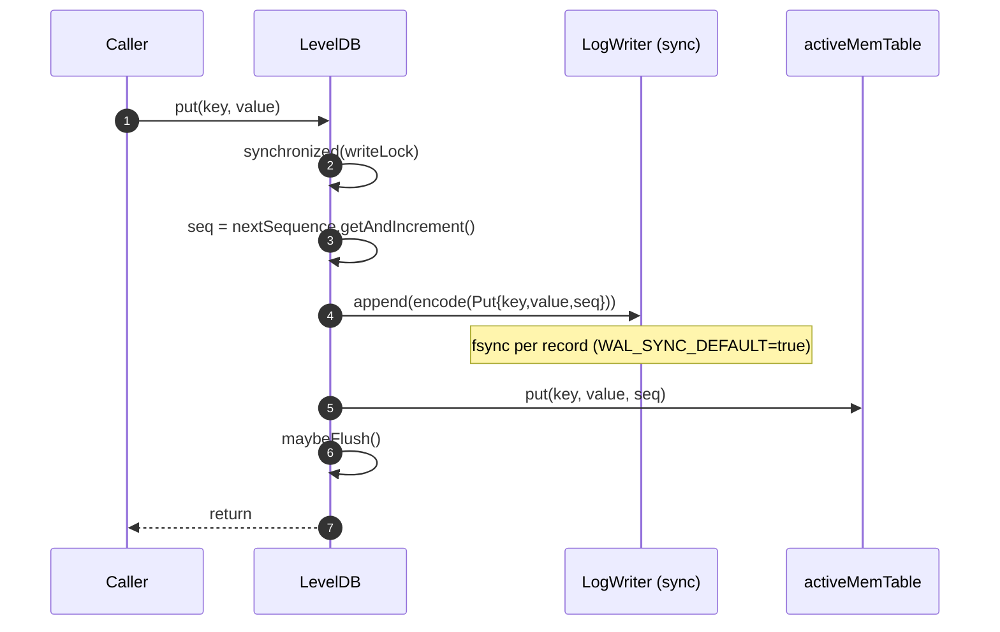
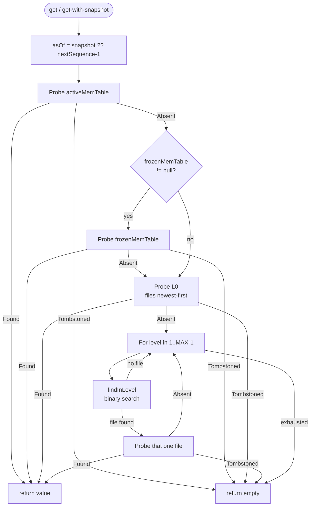
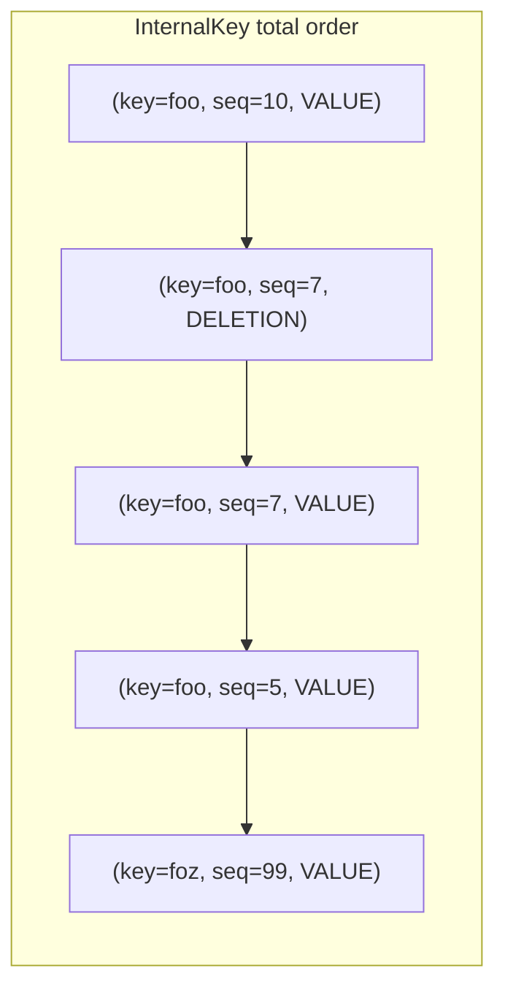
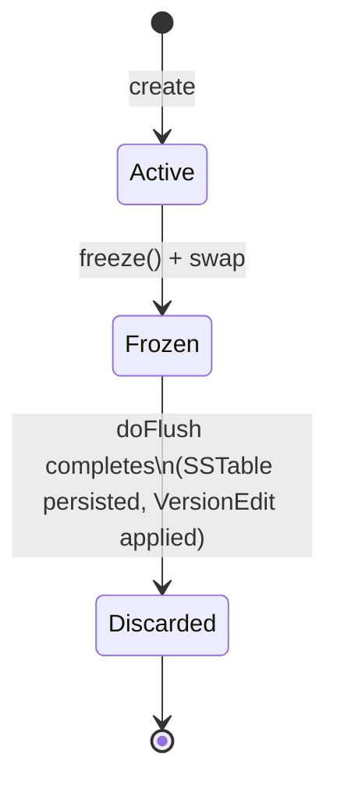
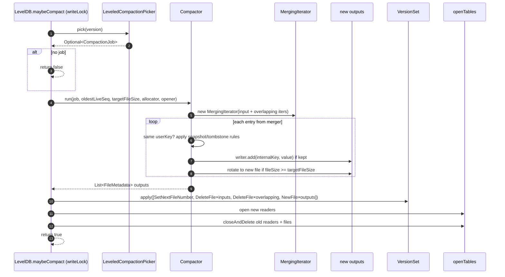
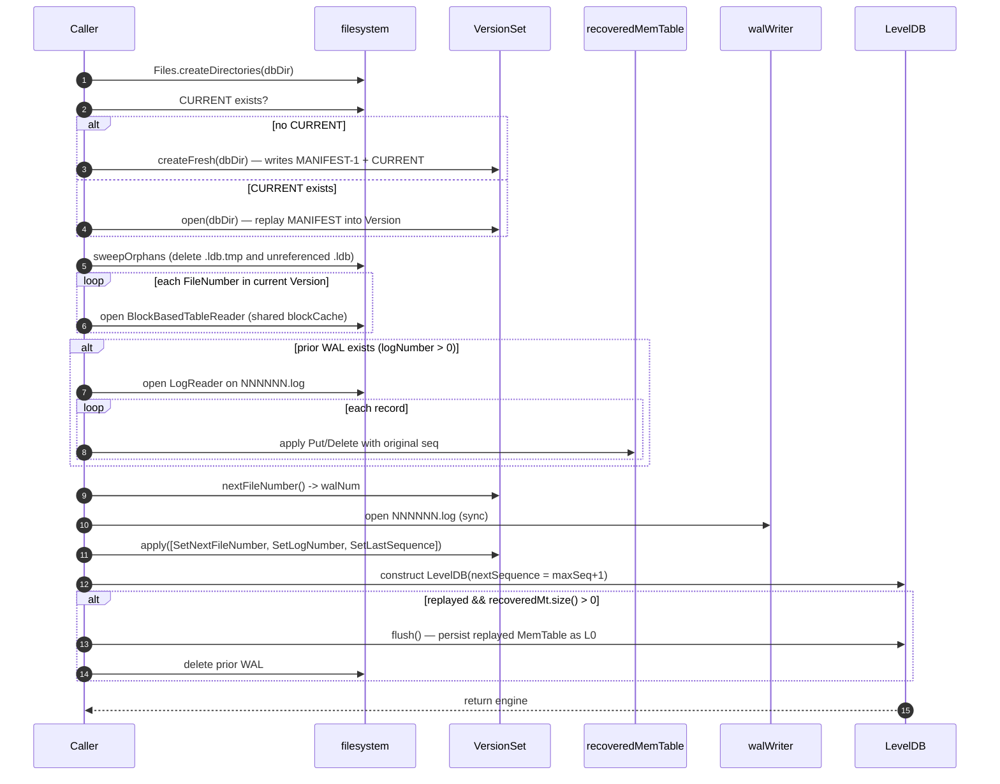

# 03. Engine semantics

This document is the runtime contract: what `LevelDB` guarantees, in what order, under which lock, and with which atomicity unit. If [02](./02-on-disk-format.md) is "what's on disk", this is "what happens when the engine runs".

All citations are `path:line` against the live source. Where prose here disagrees with Javadoc on the class, **Javadoc wins** and this document is wrong — file a doc-fix CP.

## Concurrency model

| Field | Type | Mutator constraint | Reader constraint |
|---|---|---|---|
| `writeLock` | `Object` monitor | held by every mutator | not needed by readers |
| `activeMemTable` | `volatile SkipListMemTable` | swapped under `writeLock` | single volatile read |
| `frozenMemTable` | `volatile SkipListMemTable` (nullable) | published / nulled under `writeLock` | single volatile read |
| `walWriter` | `volatile LogWriter` | swapped under `writeLock` | accessed only under `writeLock` |
| `walNumber` | `volatile FileNumber` | swapped under `writeLock` | accessed only under `writeLock` |
| `nextSequence` | `AtomicLong` | `getAndIncrement()` under `writeLock` | plain `get()` outside any lock |
| `openTables` | `ConcurrentHashMap<FileNumber, Reader>` | mutated under `writeLock` (put / remove / clear) | unsynchronised `get` (nullable result tolerated) |
| `activeSnapshotSeqs` | `ConcurrentHashMap.newKeySet()` | mutated by `snapshot` / `releaseSnapshot` without any lock | iterated by `oldestLiveSnapshotSequence` |
| `versions` | `final VersionSet` | `apply` is `synchronized` on `VersionSet`, updates `volatile current` | `versions.current()` is one volatile read |

**Writes are single-threaded** (serialised on `writeLock`). **Reads are lock-free** and traverse volatile/immutable state. **Flush and `maybeCompact` both take `writeLock`** — they never overlap with each other or with writes.

### Races that are explicitly safe

- A reader captures `SkipListMemTable active = activeMemTable;` (`LevelDB.java:251`) and then `frozenMemTable` (`:257`) **in that order**. If a flush swaps between the two reads, the reader probes the old active (still holds the entry) before the new frozen (also holds it). No gap.
- A reader captures one `Version v` (`:264`) per probe and uses it for L0 and L1+ scans. The next read may see a different Version; per-probe consistency is enough.
- `openTables.get(fm.fileNumber())` may return `null` between `versions.apply` and `openTables.put` during flush (`:417` vs `:424`). The read path guards `if (reader == null) continue;` (`:272`, `:287`). The frozen MemTable still answers correctly until step 7 of `doFlush` (see [flush](#flush) below).
- A reader that captured the old Version retains the (still-open) `BlockBasedTableReader` in `openTables` even after `closeAndDelete` runs — because deletion runs **after** the Version has been swapped (`maybeCompact` order: apply → open new readers → close+delete old). New readers see the new Version with the new files only.

### Explicitly non-linearizable

`get(key)` reads `nextSequence.get()` outside the write lock (`:239`). A write that is mid-flight (sequence allocated, WAL append in progress, MemTable insert not yet done) has already bumped the counter — but is not yet visible in the MemTable. A read after the bump but before the MemTable insert will not see the in-flight write. This is the expected LevelDB behavior: writes are visible *after* the WAL+MemTable pair is published.

---

## Write path

`put` and `delete` follow the same shape (`LevelDB.java:206-233`). Inside `synchronized (writeLock)`:



Invariants:

- `nextSequence` holds the *next* sequence to issue — `getAndIncrement()` returns the seq assigned to this mutation (`:209`).
- WAL append happens **before** MemTable insert. A crash between the two leaks a sequence number (never re-used). On recovery, `nextSequence` is set from the highest seq actually present in the WAL (`:148, :162`).
- `IOException` from WAL append → `UncheckedIOException` (`:214-216`).
- `maybeFlush` checks `activeMemTable.approximateBytes() >= MEMTABLE_FLUSH_THRESHOLD_BYTES` (4 MiB) and calls `doFlush()` under the same lock (`:373-377`).

`approximateBytes` is maintained by `SkipListMemTable.put`/`delete` as `key.length + valueLen + 9 + 32` per entry (`SkipListMemTable.java:171-175`). This is bytes, not entry count.

---

## Read path

Entry: `get(Key)` reads at `nextSequence.get() - 1` (latest committed); `get(Key, Snapshot)` reads at the snapshot's sequence. Both delegate to `readAt(key, asOf)` (`LevelDB.java:249-298`).



Detail per layer:

- **MemTable lookup** (`SkipListMemTable.java:80-106`): probe = `new InternalKey(key, asOf, ValueType.VALUE)`. `ceilingEntry(probe)` returns the smallest InternalKey `>=` probe. Because order is `(userKey ASC, seq DESC, type DESC)`, this is the newest entry for `userKey` with `seq <= asOf`. If the returned entry's userKey doesn't match → absent. If it's `Deletion` → `Tombstoned`. Else → `Found`. This works because of the load-bearing InternalKey ordering ([§internal-key invariant](#internal-key-ordering-invariant)).
- **L0 ordering** (`:267-280`): `l0.sort(Comparator.comparingLong(fm -> fm.fileNumber().value()).reversed())` — newest first by file number. L0 files may have overlapping user-key ranges, so each candidate must be range-checked via `userKeyInRange` (`:300-305`).
- **L1+ binary search** (`findInLevel`, `:308-323`): a single file per level can match. Postcondition of the search: `lo` is the smallest index whose `largestKey.userKey() >= uk`. Gap check: if `lexCompare(uk, smallest) < 0` → no covering file. Comparisons use **user key only**; sequence/type stripped.
- **Short-circuit rule** (`KeyLookup.java:6-12`): `Found` → return value; `Tombstoned` → return `Optional.empty()` (older layers NOT consulted); `Absent` → fall through. This means a delete in L0 hides a put in L1, even when both are visible to the snapshot.

If all layers exhaust → `Optional.empty()` (`:297`).

---

## Internal key ordering invariant

`InternalKey.compareTo` (`leveldb-common/.../InternalKey.java:25-31`): `(userKey ASC, sequence DESC, type DESC)`. The DESC tag tie-break is **deliberate** and **load-bearing**.

Why DESC tag matters: a snapshot lookup probes `(userKey, asOf, VALUE)` (tag `0x01`). If the user did a `put` and a same-sequence `delete` would exist (it can't in current code — sequences are unique — but the comparator is defensive), the tombstone (`Deletion`, tag `0x00`) must sort AFTER the probe so `ceilingEntry` returns the tombstone. With ASC tag, the probe (tag `0x01`) sorts after the tombstone (tag `0x00`) and `ceilingEntry` would skip the tombstone.

The packed-bytes comparator in `InternalKeyCodec.compareInternalBytes` (`InternalKeyCodec.java:49-69`) preserves the same ordering byte-for-byte against the encoded representation.



(For `userKey=foo, asOf=8`, probe is `(foo, 8, VALUE)` → `ceilingEntry` returns `b` — the tombstone at seq 7. Result: `Tombstoned`. Correct: between seqs 7 and 10 the key was deleted; the snapshot at 8 sees the delete.)

---

## Flush

Triggers:

- **Implicit** — per-write `maybeFlush` after MemTable insert if `approximateBytes >= MEMTABLE_FLUSH_THRESHOLD_BYTES` (4 MiB) (`:373-377`).
- **Explicit** — `flush()` under `writeLock` (`:363-371`).
- **Shutdown** — `close()` calls `doFlush()` if `activeMemTable.size() > 0` (`:523-524`).

```mermaid
sequenceDiagram
    autonumber
    participant Writer as Caller (writeLock)
    participant FrozenMT as frozenMemTable
    participant ActiveMT as activeMemTable
    participant WAL as walWriter
    participant SST as new .ldb
    participant VS as VersionSet
    participant Cache as openTables / blockCache
    Note over Writer: doFlush() entered with writeLock held
    Writer->>ActiveMT: toFlush = activeMemTable; toFlush.freeze()
    Writer->>FrozenMT: frozenMemTable = toFlush  (volatile publish)
    Writer->>ActiveMT: activeMemTable = new SkipListMemTable()  (volatile publish)
    Note right of FrozenMT: readers now see new (empty) active\n+ frozen with all the contents
    Writer->>VS: newWalNum = nextFileNumber()
    Writer->>WAL: close old; open new at NNNNNN.log (sync)
    Writer->>SST: BlockBasedTableWriter.open(tableNum.ldb)
    loop for each entry in frozen
        SST->>SST: add(internalKey, value)
    end
    SST->>SST: finish() — rename .ldb.tmp -> .ldb
    Writer->>VS: apply([SetNextFileNumber, SetLogNumber, SetLastSequence, NewFile(level=0, fm)])
    Note right of VS: MANIFEST append + fsync, then current = nextVersion
    Writer->>Cache: openTables.put(tableFn, BlockBasedTableReader.open(...))
    Writer->>FrozenMT: frozenMemTable = null
    Writer->>WAL: delete old NNNNNN.log
```

Reader-visible atomicity:

- **After step 2 (swap)**: new (empty) active + frozen MemTable both visible. The merged probe order makes this gap invisible to readers.
- **After step 7 (VersionSet.apply)**: the new L0 file is in `v.level(0)`. Brief window where `openTables.get(fn)` may return `null` — guard at `:272` skips; frozen MemTable still answers.
- **After step 9 (frozen = null)**: canonical answer is now the open SSTable.
- **After step 10**: old WAL deleted. Crash recovery uses the new WAL (currently empty) plus the new SSTable in MANIFEST.



---

## Compaction picker — `LeveledCompactionPicker`

`leveldb-compaction/.../LeveledCompactionPicker.java`.

**Scoring** (`:49-55`):

- L0: `score = level(0).size() / Constants.L0_FILE_COUNT_TRIGGER` (file count).
- L_n (n>0): `score = levelSizeBytes(n) / target(n)` (bytes).

**Target per level** (`:57-64`):

- L0 → `Long.MAX_VALUE` (effectively never picked by the byte rule).
- L1 → `LEVEL_SIZE_BASE_BYTES` (10 MiB).
- L_n (n>1) → previous × `LEVEL_SIZE_MULTIPLIER` (×10).

**Pick rule** (`:29-47`): scan levels `0..MAX_LEVEL_COUNT-2` (deepest level is never an input). Highest score `> 1.0` wins. Ties keep the **shallower** level (strict `>`). If `version.levels().size() < 2` → empty.

**Input selection** (`buildJob`, `:66-72`):

- L=0 → **all** L0 files become inputs.
- L>0 → **first file** of that level only (alternative to LevelDB's `compactPointer` round-robin — see comment at `:23-25`).

**Output level**: always `inputLevel + 1` (enforced in `CompactionJob.java:25-28`).

**Overlapping set** (`findOverlapping`, `:74-96`): compute `[minUser, maxUser]` as the union of input files' user-key ranges; a file at the output level overlaps iff `lex(fm.largest, minUser) >= 0 && lex(fm.smallest, maxUser) <= 0` (closed-interval overlap on user keys).

---

## Compactor — `Compactor.run`

`leveldb-compaction/.../Compactor.java`.



**Snapshot horizon rule** (`Compactor.java:110-139`, the docstring at `:25-36`):

Per user-key group (entries with the same `userKey`, in seq-DESC order):

- **Above the snapshot horizon** (`seq > oldestLiveSeq`): keep the first (newest); drop the rest — newer entry already wins for any live snapshot.
- **At or below the snapshot horizon**: keep the first one seen (the newest still visible to the oldest snapshot); drop the rest.
- **Bottom-level tombstone GC** (`outputLevel == MAX_LEVEL_COUNT - 1`): if the newest entry of a user-key group is a `Deletion` at or below the horizon, **drop the entire group** (no older entries can exist anywhere — nothing to shadow).

`NO_SNAPSHOTS_HELD = Long.MAX_VALUE` (`Compactor.java:52`). When no snapshots are held, every entry is "at or below" the horizon — bottom-level GC becomes purely "is it a tombstone?".

**Output rotation** (`:141-159`): writer is lazily created on first kept entry. After each `writer.add`, if `writer.fileSize() >= SST_FILE_TARGET_SIZE_BYTES` (2 MiB) → `finish()`, append `FileMetadata`, null the writer.

**File-number allocation**: the engine passes an `allocator` that calls `nextFileNumber` on the current Version (`LevelDB.java:445-449`). After the compactor returns, a single `SetNextFileNumber` edit bumps the counter past every allocated file (`:461`).

---

## Open + crash recovery

`LevelDB.open(...)` `:101-177`:



**`sweepOrphans` rules** (`:180-201`):

- `.ldb.tmp` → unconditionally delete.
- `.ldb` → parse filename base as long; if not in `v.allFileNumbers()` → delete. If not parseable → leave alone.
- WAL files (`.log`), MANIFEST files, CURRENT, and unrelated files are not touched.

**Sequence-number preservation**: replayed mutations keep their **original** sequence (`:143-145`). `maxSeq` tracks the highest seen and becomes the engine's `nextSequence - 1` (`:148, :162`).

**Why the immediate flush** (`:169-174`): after open, the engine wants a clean WAL — the just-replayed records are now in-memory but the old WAL still holds them. Calling `db.flush()` writes them as L0 (also opening a fresh WAL inside `doFlush`), then `Files.deleteIfExists(priorWalPath)` removes the old WAL. Net: one new L0 + one clean WAL.

**Crash safety**: every acked write is durable in the WAL (fsync per record). On reopen, WAL replay reconstructs the MemTable; the immediate flush makes it persistent. The engine never relies on the old WAL after `open` returns.

---

## Snapshot semantics

**Capture** (`:337-342`):

```
long s = nextSequence.get();
long seq = s > 0 ? s - 1 : 0;
activeSnapshotSeqs.add(seq);
return new Snapshot(new SequenceNumber(seq));
```

The captured sequence is the **last allocated** seq (`current - 1`). It is registered in `activeSnapshotSeqs` for the duration of the handle.

**Read** — `get(key, snapshot)` → `readAt(key, snapshot.sequence())` (`:245-247`). Every layer probes for the newest entry with `seq <= snapshot.sequence()`.

**Release** (`:345-347`) — removes the sequence from `activeSnapshotSeqs`. Idempotent (it's a `Set.remove`).

**Compaction interaction** — `oldestLiveSnapshotSequence()` (`:353-358`): empty set → `Long.MAX_VALUE`; otherwise smallest sequence in the set. The compactor uses this to keep entries that some live snapshot still needs.

**Crash survival**: snapshots are pure in-memory state; not persisted. After `closeWithoutFlush` and re-open, snapshot handles from the previous run are not recognised. The engine makes no cross-restart snapshot guarantee.

---

## VersionEdit application

`VersionSet.apply(List<VersionEdit>)` (`leveldb-manifest/.../VersionSet.java:94-102`):

1. `Version next = current.applyEdits(edits);` — pure functional, returns a new immutable Version (`Version.java:61-94`).
2. `manifest.append(edits);` — encodes via `VersionEditCodec`, appends as one MANIFEST record, fsyncs (delegated to `Manifest.append`).
3. `this.current = next;` — volatile publish.
4. If `manifest.bytesWritten() >= MANIFEST_ROTATION_BYTES` (4 MiB) — *currently dormant; see [00 §deferred](./00-overview.md#deferred-named-gaps-to-be-aware-of)*.

`apply` itself is `synchronized` — concurrent calls serialise. Reads of `current()` are unsynchronised single volatile reads.

Reader ordering: a reader may observe the **old** Version after the MANIFEST has been fsynced; never the **new** Version before fsync. This is correct for crash recovery — anything a reader saw is durable.

---

## Block cache (`LruBlockCache`)

`leveldb-block-cache/.../LruBlockCache.java`. Backed by `LinkedHashMap` with `accessOrder=true`; all public methods synchronized on the instance.

- **Lookup**: `lookupOrLoad(key, loader)` (`:57-75`) — holds lock to check; **releases** lock to call `loader.load()`; reacquires to insert. If a concurrent thread inserted the same key meanwhile, yield to it.
- **Eviction**: pure byte-bounded LRU. While `currentBytes > capacityBytes`, evict from the LRU end (`:92-100`). No entry-count bound, no TTL.
- **Scope**: per-engine by default (`LevelDB.open(Path)` constructs a default `LruBlockCache(BLOCK_CACHE_DEFAULT_BYTES)` at `:102`). The third `open` overload accepts an explicit cache, so callers can share one across multiple `LevelDB` instances (`:114-115`).
- **Cache key**: `CacheKey(fileNumber, offset)`. File numbers are never reused — `nextFileNumber` is bumped past every `NewFile` (`Version.java:73-76`) — so stale cache keys for deleted files are harmless. They age out by LRU.
- **Invalidation on file delete**: none. The engine does not purge cache entries when compaction deletes a file. Entries for the deleted file simply stop being looked up and age out.

---

## MergingIterator

`leveldb-compaction/.../MergingIterator.java`. N-way merge of `Iterator<SsTableEntry>` via `PriorityQueue<HeapEntry>`. Comparator (`:26-31`):

1. Primary: `InternalKey.compareTo` — `(userKey ASC, seq DESC, type DESC)`.
2. Tie-break: source index — earlier source wins.

The merger does **not** collapse duplicate user keys. Same-user-key entries surface contiguously in seq-DESC order; the **consumer** (`Compactor`) is responsible for the snapshot-aware dedup described above.

---

## Failure modes

| Condition | Behavior |
|---|---|
| WAL CRC mismatch in middle of file | `WalCorruptionException` from `LogReader` |
| WAL CRC mismatch at end of file | Treated as torn write; reader returns cleanly (`LogReader.java:201-207`) |
| Truncated WAL record at end of file | Same as torn write |
| Unknown WAL fragment tag in middle | `WalCorruptionException` |
| Unknown VersionEdit tag in MANIFEST | `IllegalArgumentException` wrapped to `ManifestCorruptionException` (`Manifest.java:65-69`) |
| SSTable block CRC mismatch | `BlockChecksumMismatchException` from reader; surfaced per-file by `DbVerify` |
| SSTable footer magic mismatch | `SsTableFormatException` (`Footer.decode`) |
| Missing `.ldb` referenced by Version | `IOException` when opening the reader (`open` fails) |
| Orphan `.ldb` (in dir but not Version) | Swept on `open` |
| `.ldb.tmp` left from a failed flush | Swept on `open` |
| Active MemTable on `closeWithoutFlush` | Lost; the WAL is the recovery source |
| Active MemTable on `close` | Flushed to L0 |
| `get` after `close` | Undefined — readers are closed, `openTables` cleared |
