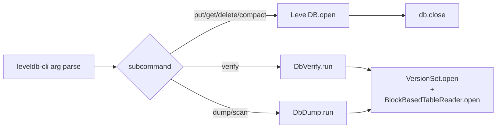

# 04. Public API and CLI

The two stable surfaces are (1) the `KvEngine` interface implemented by `LevelDB`, and (2) the `leveldb-cli` command-line wrapper. Everything else is internal — feel free to refactor.

## `KvEngine` — the engine interface

Interface declared in `leveldb-common/.../KvEngine.java`. Only one implementation: `leveldb-engine/.../LevelDB.java`.

| Method | Contract |
|---|---|
| `void put(Key, Slice)` | Insert or overwrite. Assigns a fresh sequence, appends to WAL (fsync per record), inserts into the active MemTable. Triggers `maybeFlush` after insert. Serialised on `writeLock`. Wraps `IOException` as `UncheckedIOException`. |
| `void delete(Key)` | Idempotent. Writes a tombstone (`ValueType.DELETION`) with a fresh sequence. Same WAL + MemTable + flush sequence as `put`. |
| `Optional<Slice> get(Key)` | Reads at the latest committed sequence (`nextSequence - 1`). See [03 §read path](./03-engine-semantics.md#read-path). Returns empty if absent OR tombstoned (callers cannot distinguish). |
| `Optional<Slice> get(Key, Snapshot)` | Reads at the snapshot's sequence number. Same probe order as `get(Key)`. |
| `Snapshot snapshot()` | Captures the current sequence and registers it in `activeSnapshotSeqs` (held until `releaseSnapshot`). The snapshot horizon protects covered versions from compaction garbage-collection. |
| `void releaseSnapshot(Snapshot)` | Removes the snapshot from `activeSnapshotSeqs`. Idempotent. |
| `Iterator<MutationRecord> scan(Key from, Key to)` | **Throws `UnsupportedOperationException`** in the current build. Deferred — see [00 §deferred](./00-overview.md#deferred-named-gaps-to-be-aware-of). CLI `scan` falls back to `DbDump`. |
| `void flush()` | Force the active MemTable to flush to an L0 SSTable. No-op if the active MemTable is empty. |
| `void close()` | Graceful shutdown: flush active MemTable, close WAL, close every SSTable reader, close `VersionSet`. |

## `LevelDB` — engine lifecycle

Class: `leveldb-engine/.../LevelDB.java`.

### Open variants

```java
static LevelDB open(Path dbDir)
static LevelDB open(Path dbDir, boolean compressOutput)
static LevelDB open(Path dbDir, boolean compressOutput, BlockCache blockCache)
```

| Parameter | Default | Meaning |
|---|---|---|
| `dbDir` | required | Directory holding the DB. Created if missing. If `CURRENT` is absent, a fresh DB is initialized. |
| `compressOutput` | `true` | Whether SSTables written by this engine (flushes + compactions) attempt Deflate compression. Existing SSTables are unaffected — `compType` is per-block. |
| `blockCache` | `new LruBlockCache(8 MiB)` | Shared LRU cache. Per-engine — there is no cross-instance sharing. |

`open` is the one place that:
1. Reads `CURRENT`, replays the MANIFEST.
2. Sweeps `.ldb.tmp` and orphan `.ldb` files not in the recovered Version.
3. Opens an `BlockBasedTableReader` for every referenced SSTable.
4. Replays the prior WAL into a fresh MemTable, immediately flushes it as L0, and deletes the old WAL.
5. Allocates a new active WAL and persists `SetLogNumber` / `SetLastSequence` / `SetNextFileNumber`.

See [03 §open + recovery](./03-engine-semantics.md#open--crash-recovery) for the full sequence.

### Crash hatch

```java
void closeWithoutFlush()
```

Closes the WAL and all SSTable readers **without** flushing the active MemTable. Used by `StressTest` and `CrashRecoveryTest` to simulate a process crash. Because every acked write is fsynced into the WAL, recovery on the next `open()` is bit-identical to a real crash.

### Engine-only accessors

```java
Version  currentVersion()      // immutable snapshot of the catalog
BlockCache blockCache()        // the shared cache (for tests / metrics)
long     lastSequence()        // highest assigned sequence
long     oldestLiveSnapshotSequence()  // compactor input
boolean  maybeCompact()        // run one compaction pass; returns true if anything ran
```

`maybeCompact()` is the only way to trigger compaction in the current build — there is no background thread (see [00 §deferred](./00-overview.md#deferred-named-gaps-to-be-aware-of)).

## Concurrency contract

- **Writes** are single-threaded (serialised on `writeLock`).
- **Reads** are lock-free. They traverse:
  - the volatile `activeMemTable` reference,
  - the volatile `frozenMemTable` reference (may be `null`),
  - the volatile `Version` returned by `versions.current()` (whose level lists are immutable).
  - the `ConcurrentHashMap<FileNumber, BlockBasedTableReader> openTables` for SSTable handles.
- **Snapshots** are tracked in a `ConcurrentHashMap.newKeySet()` and added to / removed from atomically. The compactor reads the min via `TreeSet` snapshot.
- `flush` and `maybeCompact` both take `writeLock` — they do not run concurrently with writes or each other.

The detail is in [03 §concurrency model](./03-engine-semantics.md#concurrency-model).

---

## CLI — `leveldb-cli`

Class: `leveldb-cli/.../LevelDbCli.java`. `main` returns one of:

| Code | Meaning |
|---|---|
| `0` | Success. |
| `1` | Logical "not found" (`get` returned empty) or `verify` reported failures. |
| `2` | Usage error or runtime/IO exception. |

### Subcommands

| Subcommand | Args | Behavior |
|---|---|---|
| `put` | `<dbDir> <key> <value>` | Open engine, `put(Key.of(key), Slice.of(value))`, close. Key/value are UTF-8. |
| `get` | `<dbDir> <key>` | Open engine, print value or `(not found)`. Exit `1` on absent. |
| `delete` | `<dbDir> <key>` | Open engine, `delete(Key.of(key))`, close. |
| `scan` | `<dbDir> [limit]` | **Current implementation delegates to `DbDump`** — the engine has no forward iterator yet. `limit` is parsed but ignored. |
| `verify` | `<dbDir>` | Run `DbVerify`. Prints per-file `L<level> NNNNNN.ldb [N entries] PASS/FAIL` lines plus a summary `scanned=N entries=N failures=N OK|CORRUPT`. Exit `1` on any failure. |
| `dump` | `<dbDir>` | Run `DbDump`. One line per entry: `L<level> <file> <hex-userkey> <hex-value> seq=<n> type=value|deletion`. |
| `compact` | `<dbDir>` | Open engine, call `maybeCompact()` once, print `compacted` or `nothing to compact`. |
| `help` / `-h` / `--help` | — | Print subcommand list. |

Every subcommand opens the engine on each invocation — there is no daemon mode. The block cache is rebuilt fresh on each run.



---

## Tool surface (programmatic, not CLI)

These are public Java APIs that the CLI wraps. Use them directly from tests or admin tooling.

### `DbVerify` — `leveldb-tools/.../DbVerify.java`

```java
DbVerify.Report report = DbVerify.run(Path dbDir);
boolean ok = report.ok();
String text = report.render();
List<FileResult> perFile = report.perFile();
```

- Opens `VersionSet` directly — does not require the engine to be closed.
- Walks every block via `BlockBasedTableReader.entries()`, recomputing block CRCs.
- Failures are surfaced as `FileResult` entries with `ok=false` and a `detail` string. The tool never throws on corruption — corruption is the **result**, not an error.
- This is the **only** integrity surface the engine exposes; per-SSTable file-level checksums are not stored separately.

### `DbDump` — `leveldb-tools/.../DbDump.java`

```java
DbDump.run(Path dbDir, PrintWriter out);
```

- Streams every internal entry from every referenced SSTable, per file, in write order.
- **No cross-file merging or tombstone collapsing** — raw on-disk view. For a snapshot-consistent view, use `engine.get`.
- Output format: `L<level> NNNNNN.ldb <hex-userkey> <hex-value> seq=<n> type=value|deletion`.

## Constants you can reach from code

All in `leveldb-common/.../Constants.java`. **No runtime configurability** — changing a knob is a recompile. See [05 §constants appendix](./05-module-reference.md#appendix-constants) for the full table with rationale.

The Constants currently consulted by the public API:

| Constant | Used by |
|---|---|
| `BLOCK_CACHE_DEFAULT_BYTES` (8 MiB) | `LevelDB.open` default cache size |
| `MEMTABLE_FLUSH_THRESHOLD_BYTES` (4 MiB) | `maybeFlush` trigger |
| `SST_FILE_TARGET_SIZE_BYTES` (2 MiB) | compaction output rotation |
| `MAX_LEVEL_COUNT` (7) | read-path probe ceiling |
