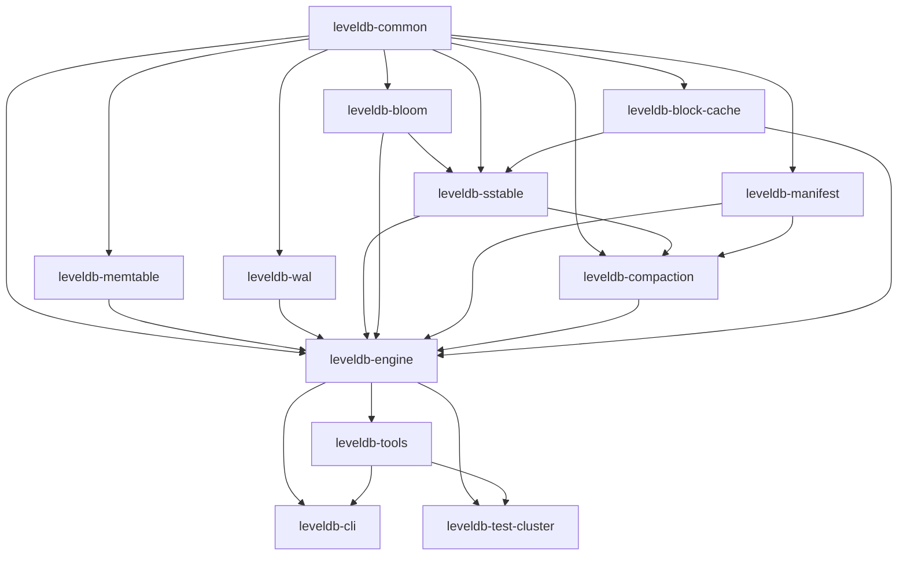

# 05. Module reference

Per-module deep dive. Each section lists the responsibility, key classes (with file:line for the entry points), what depends on this module, and notable invariants. The dependency graph is repeated at the top for context.

The wiring lives in the **root** `build.gradle` (per-module `build.gradle` files are intentionally empty). To change the graph, edit the root file and `settings.gradle`.

---

## `leveldb-common`

**Responsibility**: domain types shared by every other module. No external dependencies beyond the JDK.

**Key classes**:

| Class | File | Notes |
|---|---|---|
| `Slice` | `Slice.java:16` | Read-only `(backing, offset, length)`. Backing array NOT defensively copied. |
| `Key` | `Key.java` | User-supplied lookup key; wraps `byte[]`; lex-ordered (unsigned). |
| `ValueType` | `ValueType.java:21-35` | `Value = 0x01`, `Deletion = 0x00`. |
| `SequenceNumber` | `SequenceNumber.java` | 56-bit monotonic counter; `MAX = 2^56 - 1`. |
| `InternalKey` | `InternalKey.java:25-31` | **Load-bearing comparator**: `(userKey ASC, seq DESC, type DESC)`. See [03 §internal-key invariant](./03-engine-semantics.md#internal-key-ordering-invariant). |
| `InternalKeyCodec` | `InternalKeyCodec.java` | Encode/decode and packed-byte comparator. |
| `MutationRecord` | `MutationRecord.java:9` | Sealed: `Put`, `Delete`. WAL payload type. |
| `KeyLookup` | `KeyLookup.java:6-12` | Sealed: `Found`, `Tombstoned`, `Absent`. |
| `Snapshot` | `Snapshot.java` | Wraps a `SequenceNumber`. In-memory only — does not survive crashes. |
| `FileNumber` | `FileNumber.java:23-33` | Monotonic id; formats `NNNNNN.ldb` / `NNNNNN.log` / `MANIFEST-NNNNNN`. |
| `KvEngine` | `KvEngine.java` | Public engine interface. Sole implementation: `LevelDB`. |
| `Constants` | `Constants.java` | All compile-time knobs. See [§appendix](#appendix-constants). |

**Depended on by**: every other module.

**Invariants**:

- `Slice` is immutable by contract. Don't mutate backing arrays after handing one in.
- `InternalKey.compareTo` is **never** to be "simplified" — the DESC tag tie-break is critical for the read path.
- `SequenceNumber` value is in `[0, MAX_SEQUENCE_NUMBER]`. Higher bits of the 64-bit storage are reserved for the trailer pack.

---

## `leveldb-memtable`

**Responsibility**: in-memory sorted store with a freeze protocol.

**Key classes**:

| Class | File | Notes |
|---|---|---|
| `SkipListMemTable` | `SkipListMemTable.java:38` | `ConcurrentSkipListMap<InternalKey, byte[]>`. Freezable via `AtomicBoolean`. |

**Depended on by**: `leveldb-engine`.

**Invariants**:

- After `freeze()`, `put`/`delete` throw. Reads still work.
- `approximateBytes` is per-entry `key.length + valueLen + 9 + 32` — used by the flush trigger. Accuracy is not critical (it's a trigger, not a quota).
- Iteration order is `InternalKey` order — required by SSTable writer, which expects sorted input.

---

## `leveldb-wal`

**Responsibility**: durable append log with crash-recoverable framing. Used both as the engine WAL and (via the shared `LogWriter`/`LogReader`) as the MANIFEST log.

**Key classes**:

| Class | File | Notes |
|---|---|---|
| `WalConstants` | `WalConstants.java:21-27` | `BLOCK_SIZE=32 KiB`, `HEADER_SIZE=7`. |
| `RecordType` | `RecordType.java:6-22` | `ZERO_PADDING=0, FULL=1, FIRST=2, MIDDLE=3, LAST=4`. |
| `LogWriter` | `LogWriter.java:132-151` | Fragment framing + per-record fsync (sync mode). |
| `LogReader` | `LogReader.java:155-207` | Block-aware reader with tail-of-file torn-write tolerance. |
| `MutationCodec` | `MutationCodec.java:31-86` | Encode/decode `MutationRecord`. **Fixed-width prefixes**, not varints. |
| `WalCorruptionException` | `WalCorruptionException.java` | Mid-file corruption — thrown by reader. |

**Depended on by**: `leveldb-manifest` (MANIFEST framing), `leveldb-engine`.

**Invariants**:

- CRC covers `type ‖ payload` only. Not the length field, not the CRC itself.
- Padding rule fires when `blockLeft < HEADER_SIZE (7)`; never when there's room for at least a 0-byte-payload fragment.
- Torn-write tolerance applies **only** at end-of-file. Mid-file corruption is fatal.

See [02 §A](./02-on-disk-format.md#a-wal-physical-framing-also-used-by-manifest) and [02 §B](./02-on-disk-format.md#b-wal-record-payload--mutationrecord) for the byte layouts.

---

## `leveldb-bloom`

**Responsibility**: probabilistic membership filter for SSTable lookups.

**Key classes**:

| Class | File | Notes |
|---|---|---|
| `BloomFilter` | `BloomFilter.java:45,80-87` | FNV-1a base + `Integer.rotateRight(hash, 17)` for second probe. **Deviation from LevelDB C++** which uses a single-hash trick on a Murmur-like base. |

**Depended on by**: `leveldb-sstable` (one filter per SSTable, written into the filter block).

**Invariants**:

- 10 bits per key (`Constants.BLOOM_BITS_PER_KEY`) → ~1% false-positive rate.
- The hash is intentionally not LevelDB-C++-compatible. Don't switch to Murmur without ADR; it's recorded as a pedagogical departure.

---

## `leveldb-sstable`

**Responsibility**: immutable on-disk table format — readers and writers, footer, varint, compression, block format.

**Key classes**:

| Class | File | Notes |
|---|---|---|
| `BlockBuilder` | `BlockBuilder.java:69-117` | Key-prefix compression with `RESTART_INTERVAL=16`. Restart trailer at block end. |
| `Block` | `Block.java:25-66` | Reader for the block payload. |
| `BlockHandle` | `BlockHandle.java:14-23` | `varlong(offset) varlong(length)`. `MAX_ENCODED_LENGTH=20`. |
| `Footer` | `Footer.java:18-53` | Fixed 48 bytes. Magic `0xDB4775248B80FB57`. |
| `VarInt` | `VarInt.java:14-49` | LEB128, max 10 bytes for int64. |
| `Compression` | `Compression.java:17-18` | Two codecs: `TYPE_NONE=0x00`, `TYPE_DEFLATE=0x01` (zlib via `Deflater nowrap=false`). |
| `BloomBlock` | `BloomBlock.java:11-44` | Filter block layout. **Not byte-compatible with LevelDB C++** (intentional). |
| `BlockBasedTableWriter` | `BlockBasedTableWriter.java:152-173` | Writer; appends `compType:1 + crc:4` trailer to each block. |
| `BlockBasedTableReader` | `BlockBasedTableReader.java:244-268` | Reader; reads `length + 5` bytes per block; recomputes CRC. |
| `BlockChecksumMismatchException` | `BlockChecksumMismatchException.java` | Surfaced by `DbVerify`. |
| `SsTableFormatException` | `SsTableFormatException.java` | Footer-magic / varint-too-long / parser errors. |

**Depended on by**: `leveldb-compaction`, `leveldb-engine`, `leveldb-tools`.

**Invariants**:

- BlockHandle length = body bytes (excludes the 5-byte trailer).
- Index and meta-index blocks are always uncompressed (`compType=0x00`) but still get the trailer.
- Footer is always exactly 48 bytes at end-of-file.
- Compression only enabled for **data blocks**; writer only adopts compression if it strictly shrinks the payload (`writeBlock`).

See [02 §C-F](./02-on-disk-format.md#c-internalkey-encoding) for the byte layouts.

---

## `leveldb-manifest`

**Responsibility**: catalog of SSTables — versioned, append-only, crash-recoverable. Wraps `leveldb-wal` for physical framing.

**Key classes**:

| Class | File | Notes |
|---|---|---|
| `VersionEdit` | `VersionEdit.java:18-55` | Sealed: `NewFile=0x10`, `DeleteFile=0x11`, `SetLogNumber=0x12`, `SetNextFileNumber=0x13`, `SetLastSequence=0x14`. |
| `VersionEditCodec` | `VersionEditCodec.java:37-110` | Encode/decode; inline varlong helpers (bit-identical with `VarInt`). |
| `FileMetadata` | `FileMetadata.java` | `(fileNumber, sizeBytes, smallestInternalKey, largestInternalKey)`. |
| `Version` | `Version.java:61-94` | Immutable per-level lists; `applyEdits(edits) → newVersion`. |
| `VersionSet` | `VersionSet.java:94-102` | Mutable container; `apply` is synchronized; updates `volatile current`. |
| `Manifest` | `Manifest.java:34-73` | Thin wrapper over `LogWriter`/`LogReader`. |
| `ManifestCorruptionException` | `ManifestCorruptionException.java` | Wraps codec errors during replay. |

**Depended on by**: `leveldb-compaction`, `leveldb-engine`, `leveldb-tools`.

**Invariants**:

- `Version` is immutable. Mutation = `applyEdits` returns a new instance.
- `VersionSet.apply` ordering: build next Version → append+fsync MANIFEST → swap `current`. Readers may see the old Version after the MANIFEST is on disk; **never** the new Version before MANIFEST fsync.
- File numbers are never reused. `applyEdits` bumps `nextFileNumber` past every `NewFile` (`Version.java:73-76`).
- Unknown `VersionEdit` tag is fatal (`IllegalArgumentException` → `ManifestCorruptionException`). The codec does not skip unknown tags.

See [02 §G](./02-on-disk-format.md#g-manifest-record-payload--versionedit) and [03 §VersionEdit application](./03-engine-semantics.md#versionedit-application).

---

## `leveldb-compaction`

**Responsibility**: pick + execute leveled compactions.

**Key classes**:

| Class | File | Notes |
|---|---|---|
| `CompactionJob` | `CompactionJob.java:25-28` | `(inputLevel, inputs, outputLevel, overlapping)`. `outputLevel == inputLevel + 1`. |
| `LeveledCompactionPicker` | `LeveledCompactionPicker.java:29-96` | Score-based; L0 by file count, L1+ by byte size. |
| `MergingIterator` | `MergingIterator.java:23-57` | N-way merge by `InternalKey` order; ties broken by source index. |
| `Compactor` | `Compactor.java:78-186` | Executes a `CompactionJob`; consumer of `MergingIterator`. Implements the snapshot-horizon rule. |

**Depended on by**: `leveldb-engine`.

**Invariants**:

- Picker scans `0..MAX_LEVEL_COUNT - 2` — the deepest level is never an input.
- Highest score `> 1.0` wins; ties keep the shallower level (strict `>`).
- For L0 picks, **all** L0 files are inputs.
- Compactor drops a tombstone group entirely only when `outputLevel == MAX_LEVEL_COUNT - 1` AND the tombstone is at-or-below the snapshot horizon.
- Output rotation at `SST_FILE_TARGET_SIZE_BYTES` (2 MiB).
- File-number allocation goes through a caller-supplied `Allocator` (driven by `VersionSet.nextFileNumber`); the engine reconciles with one `SetNextFileNumber` edit after the run.

See [03 §compaction picker](./03-engine-semantics.md#compaction-picker--leveledcompactionpicker) and [§compactor](./03-engine-semantics.md#compactor--compactorrun).

---

## `leveldb-block-cache`

**Responsibility**: shared, byte-bounded LRU of decompressed SSTable blocks.

**Key classes**:

| Class | File | Notes |
|---|---|---|
| `BlockCache` | `BlockCache.java` | Interface — `lookup`, `insert`, `lookupOrLoad`. |
| `CacheKey` | `CacheKey.java` | `(FileNumber, offset)`. |
| `LruBlockCache` | `LruBlockCache.java:38,57-75,92-100` | `LinkedHashMap accessOrder=true`; all methods synchronized; releases lock during `loader.load()`. |

**Depended on by**: `leveldb-sstable` (readers consult the cache); `leveldb-engine` (constructs the shared cache).

**Invariants**:

- Per-engine by default. `LevelDB.open(Path)` constructs a default `LruBlockCache(8 MiB)`. Callers can share an explicit cache across engines via the third `open` overload, but this is opt-in.
- File numbers are never reused, so stale cache keys for deleted files are harmless. The engine does **not** purge on file delete.
- Pure byte-bounded LRU; no entry-count bound, no TTL.

---

## `leveldb-engine`

**Responsibility**: assemble everything. The only module that knows the read path, the write path, the flush sequence, the recovery dance, the compaction wiring.

**Key classes**:

| Class | File | Notes |
|---|---|---|
| `LevelDB` | `LevelDB.java:60-559` | Single implementation of `KvEngine`. All public lifecycle and semantics. |

**Depended on by**: `leveldb-tools`, `leveldb-cli`, `leveldb-test-cluster`.

**Invariants**:

- `writeLock` serialises every mutator (`put`, `delete`, `flush`, `maybeCompact`, `close`, `closeWithoutFlush`).
- `nextSequence` allocation precedes WAL append, which precedes MemTable insert.
- `doFlush` order is fixed: freeze + swap → new WAL → write SSTable → apply VersionEdit → open reader → null frozen → delete old WAL.
- `open` sequence is fixed: replay MANIFEST → sweep orphans → open readers → replay WAL → allocate new WAL → apply header edits → immediate flush of recovered MemTable → delete old WAL.
- `closeWithoutFlush` exists for crash simulation in tests; do not use it as a fast-shutdown path.

See [03 §write path](./03-engine-semantics.md#write-path), [§read path](./03-engine-semantics.md#read-path), [§flush](./03-engine-semantics.md#flush), [§open + crash recovery](./03-engine-semantics.md#open--crash-recovery).

---

## `leveldb-tools`

**Responsibility**: offline operator tools that work against a closed DB.

**Key classes**:

| Class | File | Notes |
|---|---|---|
| `DbVerify` | `DbVerify.java:39-83` | Block-CRC walk over every referenced SSTable. Returns `Report`; never throws on corruption. |
| `DbDump` | `DbDump.java:34-66` | Streams every internal entry as `L<level> <file> <hex-userkey> <hex-value> seq=<n> type=value|deletion`. Raw — no merging or tombstone collapse. |

**Depended on by**: `leveldb-cli`, `leveldb-test-cluster`.

**Invariants**:

- Both tools open `VersionSet` directly. They require the engine to be **closed** (or not opened) — they don't take the engine's `writeLock`.
- `DbVerify` is the **only** programmatic integrity surface. Per-file checksums are not stored; the SSTable footer magic + block CRCs are all there is.

See [04 §tool surface](./04-api-and-cli.md#tool-surface-programmatic-not-cli).

---

## `leveldb-cli`

**Responsibility**: command-line wrapper over `leveldb-engine` + `leveldb-tools`.

**Key classes**:

| Class | File | Notes |
|---|---|---|
| `LevelDbCli` | `LevelDbCli.java:42-163` | Subcommand dispatcher; opens engine per command. |

**Depended on by**: nothing (leaf).

**Invariants**:

- No daemon mode. Every subcommand opens and closes the engine fresh.
- `scan` currently delegates to `DbDump` because `KvEngine.scan` throws (see [00 §deferred](./00-overview.md#deferred-named-gaps-to-be-aware-of)).
- Exit codes: `0` success, `1` logical-failure (not-found / verify-failed), `2` usage / I/O error.

See [04 §CLI](./04-api-and-cli.md#cli).

---

## `leveldb-test-cluster`

**Responsibility**: integration tests — end-to-end stress and crash recovery.

**Key tests**:

| Test | File | Notes |
|---|---|---|
| `StressTest` | `StressTest.java:40` | Randomised put/delete/get/snapshot/crash workload. 5 s default; `-Dleveldb.stress.duration.seconds=600` for soak. |
| `CrashRecoveryTest` | `CrashRecoveryTest.java` | Targeted crash-and-recover scenarios. |

**Depended on by**: nothing (leaf).

**Invariants**:

- Tests use `closeWithoutFlush` to simulate crashes — the engine MUST replay every acked write from the WAL on next `open`.
- After every test, `DbVerify` runs and is asserted clean.
- Seed is overridable via `-Dleveldb.stress.seed=...`; default is `0xC0FFEEL` for reproducibility.

---

## Appendix: Constants

All in `leveldb-common/.../Constants.java`. **No runtime configurability** — changing a value is a recompile.

| Constant | Value | Consumed by | Rationale |
|---|---|---|---|
| `MEMTABLE_FLUSH_THRESHOLD_BYTES` | `4 * 1024 * 1024` (4 MiB) | `LevelDB.maybeFlush` | Standard LevelDB write-buffer size; bounds WAL replay cost. |
| `BLOCK_SIZE_BYTES` | `4 * 1024` (4 KiB) | `BlockBuilder` | Target uncompressed block size for SSTable data blocks. |
| `L0_FILE_COUNT_TRIGGER` | `4` | `LeveledCompactionPicker` | L0 score divisor — compaction kicks in around 4 files. |
| `LEVEL_SIZE_BASE_BYTES` | `10 * 1024 * 1024` (10 MiB) | `LeveledCompactionPicker.targetForLevel` | L1 target byte size. |
| `LEVEL_SIZE_MULTIPLIER` | `10` | `LeveledCompactionPicker.targetForLevel` | The "K" of leveled compaction. |
| `MAX_LEVEL_COUNT` | `7` | `LevelDB.readAt`, `Compactor` (bottom-level GC) | Maximum on-disk levels; bounds read amplification. |
| `BLOOM_BITS_PER_KEY` | `10` | `BloomFilter` | ~1% false-positive rate. |
| `BLOOM_FILTER_FPP` | `0.01` | `BloomFilter` | Target FPR; informational. |
| `BLOCK_CACHE_DEFAULT_BYTES` | `8L * 1024 * 1024` (8 MiB) | `LevelDB.open` default | Default LRU cache size. |
| `WAL_SYNC_DEFAULT` | `true` | `LogWriter.open` callers | Per-record fsync; gives the durability contract. |
| `COMPRESSION_TYPE_DEFLATE` | `"deflate"` | Tag identifier | String used for diagnostics; on-disk byte is `0x01`. |
| `MAX_SEQUENCE_NUMBER` | `(1L << 56) - 1` | `SequenceNumber` | 56-bit ceiling; high byte reserved for `ValueType` tag in the InternalKey trailer. |
| `MANIFEST_ROTATION_BYTES` | `4L * 1024 * 1024` (4 MiB) | `VersionSet.apply` (currently dormant — see [00 §deferred](./00-overview.md#deferred-named-gaps-to-be-aware-of)) | Threshold above which a new MANIFEST is written. |
| `SST_FILE_TARGET_SIZE_BYTES` | `2L * 1024 * 1024` (2 MiB) | `Compactor` output rotation | Per-output-file target size during compaction. |
| `L0_SLOWDOWN_WRITES_TRIGGER` | `8` | (defined, **not currently enforced**) | Future write-stall threshold. |
| `L0_STOP_WRITES_TRIGGER` | `12` | (defined, **not currently enforced**) | Future write-stop threshold. |
