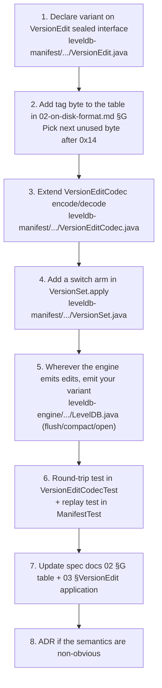

# 06. Extension guide

How to add things to this codebase without breaking the conventions. Each recipe lists the files to touch, the tests to add, and the ADR you owe.

## 0. Conventions you must follow

- **Java 17.** Use records, sealed types, pattern-matching `switch` expressions. The codebase leans on these heavily and adding ceremony (separate equals/hashCode, visitor pattern, enums-as-classes) is a code smell.
- **No runtime configurability.** Every knob lives in `leveldb-common/.../Constants.java`. Adding a tunable means a new `Constants` field, not an options object. This mirrors LevelDB C++ and keeps the engine fits-in-your-head.
- **Sealed + switch expressions.** When you add a new variant to `MutationRecord`, `KeyLookup`, `VersionEdit`, every exhaustive `switch` over that type will fail to compile until you handle the new arm. That is the design.
- **Javadoc carries rationale.** When you add a non-obvious invariant (a comparator that breaks naive expectations, a lock-free protocol, a recovery sequence), document it in the Javadoc — don't bury it in a unit test name.
- **`Slice` is read-only.** Don't mutate a backing array after handing it to `Slice.of(...)`. The codebase relies on this.
- **No defensive copies inside the engine.** Slices and byte arrays are passed by reference; the contract is "caller doesn't mutate".

## 1. How a CP is born

The repo is built in 12 ordered checkpoints across 3 phases — all complete. New work post-Phase 3 should still follow the convention:

1. One CP = one commit. No squashing across CPs.
2. Commit subject: `leveldb-java: Phase N CP M: <short subject> (<comma-separated affected modules>)`.
3. Commit body: short paragraph stating what's done and what's deferred.
4. Each CP should be self-contained: tests pass, no half-implemented features behind flags.
5. Reference the CP from the Javadoc of the class(es) introduced (`Phase 2 CP 7 scope: ...`).

If your change does not fit into a CP — bug fix, refactor, doc update — use a plain `leveldb-java: <subject>` subject.

## 2. ADR process

When a design choice diverges from LevelDB C++ or commits to something that will be expensive to reverse, file an ADR.

1. Copy `docs/adr/0000-template.md` → `docs/adr/NNNN-<slug>.md` with the next free number.
2. Fill in Status / Date / Phase / CP, then Context / Decision / Rationale / Consequences / Alternatives / References.
3. Reference the ADR from the Javadoc of every class affected (`// see ADR-0008 for why Deflate not Snappy`).
4. Status moves from `proposed` → `accepted` when merged. If it's later overturned, leave the file in place and add a new ADR with `Status: accepted, supersedes ADR-NNNN`; mark the old one `superseded by ADR-MMMM`.

The codebase already references ADR-0008 (compression choice) from `README.md` — that's the model.

## 3. Tests

- JUnit 5 + AssertJ. Set up by the root `build.gradle`; per-module `build.gradle` files are intentionally empty.
- Mirror the source layout: a class at `leveldb-foo/src/main/java/com/hkg/leveldb/foo/Bar.java` gets tested at `leveldb-foo/src/test/java/com/hkg/leveldb/foo/BarTest.java`.
- Use `@TempDir Path dir` for any test that hits the filesystem — the integration tests do, and engine tests must.
- Stress / soak tests live in `leveldb-test-cluster` and read system properties for tunables (`-Dleveldb.stress.duration.seconds`, `-Dleveldb.stress.seed`).
- Round-trip tests are non-negotiable for codecs. Every codec change needs an encode → decode → equals test.

### Running

```bash
./gradlew build                                          # full build + all tests
./gradlew :leveldb-foo:test                              # one module
./gradlew :leveldb-foo:test --tests BarTest              # one class
./gradlew :leveldb-foo:test --tests BarTest.fooCase      # one method
```

There is no separate lint step. `./gradlew build` is the gate.

---

## Recipe A — Add a new `VersionEdit` variant



The compiler enforces steps 1+3 via the sealed `switch` — if you forget a decode arm, the test build fails. Steps 4+5 are the runtime wiring.

## Recipe B — Add a new SSTable feature (new block type, new index, etc.)

1. **Decide if this is a format-breaking change.** The footer magic is `0xDB4775248B80FB57` — bumping it (and gating on it in `Footer.decode`) is the cleanest signal that an SSTable was written by a newer engine.
2. **Layout first, code second.** Sketch the byte layout into [02-on-disk-format.md](./02-on-disk-format.md) before writing code. Diff your prose with what the writer/reader will emit.
3. **Bump `Footer.ENCODED_LENGTH`** only if you must — every consumer reads "last 48 bytes". A length change means coordinated reader updates.
4. **Implement writer first**, then reader, then round-trip test (`BlockBasedTableTest` style — feed bytes through, decode, assert equal).
5. **Run `DbVerify` against the new file.** If it spuriously fails or spuriously passes, your CRC scope is wrong (see [02 §H](./02-on-disk-format.md#h-integrity-surface)).
6. **ADR** if the layout deviates from LevelDB C++ in a new way (BloomBlock is the precedent — see `BloomBlock.java:11-14`).

## Recipe C — Add a new CLI subcommand

1. Add a case branch to the `switch` in `LevelDbCli.run` (`leveldb-cli/.../LevelDbCli.java`).
2. Add a `cmdXxx(String[] args)` method following the existing pattern (validate arg count → open engine → do work → close).
3. Add a line to `printHelp`.
4. Add a test class in `leveldb-cli/src/test/java/.../LevelDbCliTest.java` capturing stdout/stderr and asserting the exit code.
5. Add a row to the subcommand table in [04 §CLI](./04-api-and-cli.md#cli).

If the operation needs engine support that does not exist, expose a minimal accessor on `LevelDB` (don't reach into internals from the CLI — `leveldb-cli` only depends on `leveldb-engine` + `leveldb-tools`).

## Recipe D — Add a new module

Rare. But if you do:

1. Create `leveldb-NAME/src/{main,test}/java/com/hkg/leveldb/NAME/` (the empty leaf path matters for the package).
2. Create an empty `leveldb-NAME/build.gradle` (every per-module file is empty by convention; config lives in root).
3. Add `include 'leveldb-NAME'` to `settings.gradle`.
4. Add the dependency wiring stanza to the **root `build.gradle`** in the same style as the existing modules.
5. Update `docs/architecture.md` (the at-a-glance dep graph) AND [05-module-reference.md](./05-module-reference.md).
6. Confirm `./gradlew :leveldb-NAME:test` and `./gradlew build` both pass.

## Recipe E — Change a `Constants` value

1. Change the field in `leveldb-common/.../Constants.java`.
2. Audit every reference: `grep -r "Constants\.<FIELD>" .`
3. Update the value in [05 §appendix](./05-module-reference.md#appendix-constants) AND in any tests that hardcode the old value.
4. ADR if the change affects on-disk format, durability, or worst-case write amplification (e.g. changing `LEVEL_SIZE_MULTIPLIER`).

## Recipe F — Add a new `Constants` field

1. Add the constant with full Javadoc — what it controls, where it's consulted, why this default.
2. Reference its origin in LevelDB C++ if applicable (e.g. `// Mirrors leveldb/util/options.h:kMaxLevelSize`).
3. Cite from [00 §in scope](./00-overview.md#in-scope) or [00 §deferred](./00-overview.md#deferred-named-gaps-to-be-aware-of) if it gates a feature.

---

## What goes where (file routing cheat sheet)

| You're changing… | Touch this module |
|---|---|
| Domain types (Slice, Key, InternalKey, Snapshot, ValueType, FileNumber, Constants, KvEngine interface, MutationRecord, KeyLookup) | `leveldb-common` |
| MemTable structure or freeze protocol | `leveldb-memtable` |
| WAL format, record framing, mutation codec | `leveldb-wal` |
| Bloom filter math, hash functions | `leveldb-bloom` |
| SSTable block layout, footer, compression, varint, BlockHandle | `leveldb-sstable` |
| MANIFEST format, VersionEdit, Version semantics | `leveldb-manifest` |
| Compaction picking algorithm, merging iterator, snapshot horizon | `leveldb-compaction` |
| Block cache policy, CacheKey, eviction | `leveldb-block-cache` |
| Engine wiring, read path, flush path, open/close, recovery | `leveldb-engine` |
| Operator tools (DbVerify, DbDump) — anything you'd run against a closed DB | `leveldb-tools` |
| End-to-end / crash-recovery / stress tests | `leveldb-test-cluster` |
| CLI subcommands | `leveldb-cli` |
| Architectural decisions | `docs/adr/` |
| Specs | `docs/spec/` |
